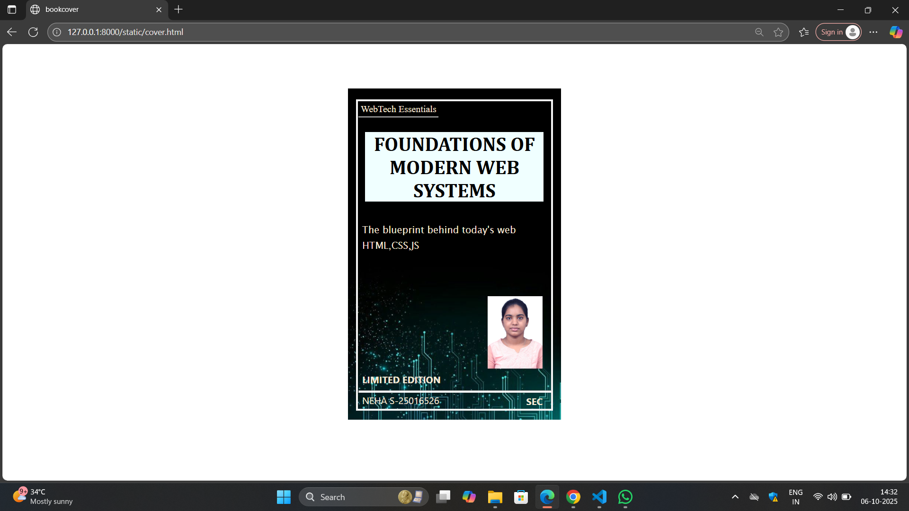

# Ex.06 Book Front Cover Page Design
## Date:06/10/2025

## AIM:
To design a book front cover page using HTML and CSS.

## DESIGN STEPS:

### Step 1:
Create a Django Admin project.

### Step 2:
Create an app in the Django interface.

### Step 3:
Create a folder named 'static' in the app folder.

### Step 4:
Create a new HTML file in the static folder.

### Step 5:
Write the HTML code with relevant CSS properties.

### Step 6:
Choose the appropriate style and color scheme.

### Step 7:
Insert the images in their appropriate places.

### Step 8:
Publish the website in the LocalHost.

## PROGRAM:
```
cover.html

<html>
    <head>
        <title>bookcover</title>
        <link rel="stylesheet" href="styles.css">
    </head>
    <body>
        <div class="bookbg">
        <div class="border">

        <div class="text1">WebTech Essentials</div>
        <div><hr class="line1"></div>
        <div class="title">FOUNDATIONS OF MODERN WEB SYSTEMS</div>
        <div class="text2">The blueprint behind today's web</div>
        <div class="text3">HTML,CSS,JS</div>
        <div class="photo"></div>
        <div class="text4">LIMITED EDITION</div>
         <div><hr class="line2"></div>
         <div class="text5">NEHA S-25016526</div>
         <div class="text6">SEC</div>
        </div>
        </div>
    </body>

</html>

styles.css

.bookbg{
            width: 500px;
            height: 800px;
            margin-left: auto;
            margin-right: auto;
            margin-top: 3cm;
            padding: 20px;
            background-image: url("bookcover.jpeg");
            background-size: cover;
        }
.border{
    margin-top: 0.2cm;
    width: 490px;
    height:780;
    border: solid 5px whitesmoke;
    background-size: cover;
}
.text1{
    top: 4cm;
    margin-left:0.2cm;
    font-style: bold;
    position: absolute;
    font-size: x-large;
    font-weight: 300;
    color:antiquewhite;
}
.line1{
    width: 200px;
    background-color:white;
    margin-top: 1cm;
    margin-left:0.3%;
    
}
.title{
    margin-top:1cm;
    font-family:Cambria, Cochin, Georgia, Times, 'Times New Roman', serif;
    font-weight:bolder;
    font-size: 50px;
    margin-left:0.5cm;
    margin-right: 0.5cm;
    text-align: center;
    color:black;
    background-color:azure;
}
.text2{
    margin-top: 1.5cm;
    margin-left:0.3cm;
    font-family:'Lucida Sans', 'Lucida Sans Regular', 'Lucida Grande', 'Lucida Sans Unicode', Geneva, Verdana, sans-serif;
    font-size:x-large;
    font-weight: 300;
    color:antiquewhite;

}
.text3{
    margin-top: 0.3cm;
    margin-left:0.3cm;
    font-family:'Lucida Sans', 'Lucida Sans Regular', 'Lucida Grande', 'Lucida Sans Unicode', Geneva, Verdana, sans-serif;
    font-size:x-large;
    font-weight: 300px;
    color:antiquewhite;

}
.photo{
    margin-top:3cm;
    margin-left:8.7cm;
    width: 50px;
}
.text4{
    margin-top:0.3cm;
    margin-left:0.3cm;
    font-family:'Segoe UI', Tahoma, Geneva, Verdana, sans-serif;
    font-size:x-large;
    font-weight: bold;
    color:antiquewhite;
}
.line2{
    width: 487px;
    height:4px;
    background-color:white;
    margin-top: 0.3cm;
    margin-left:0.37%;
}
.text5{
    margin-top: -5px;
    margin-left:0.3cm;
    font-family:'Segoe UI', Tahoma, Geneva, Verdana, sans-serif;
    font-size:x-large;
    font-weight:1200px;
    color:antiquewhite;

}
.text6{
     margin-top: -30px;
    margin-left:11.3cm;
    font-family:'Segoe UI', Tahoma, Geneva, Verdana, sans-serif;
    font-size:x-large;
    font-weight:bold;
    color:antiquewhite;

}
```

## OUTPUT:


## RESULT:
The program for designing book front cover page using HTML and CSS is completed successfully.
